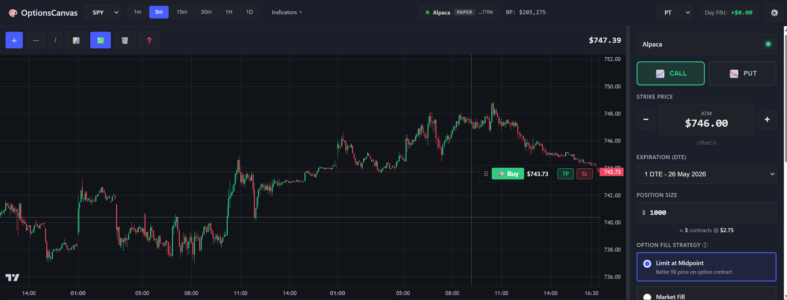
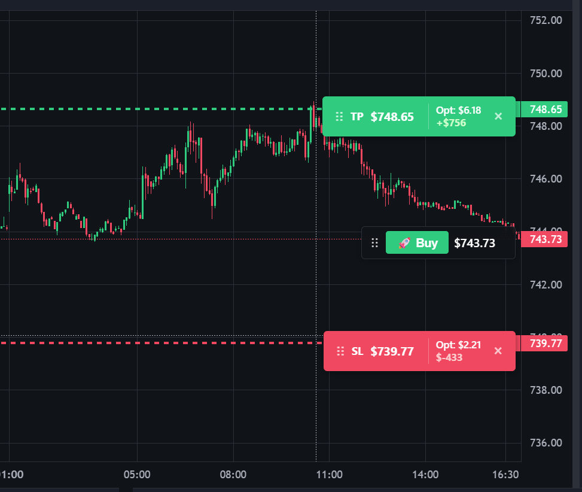
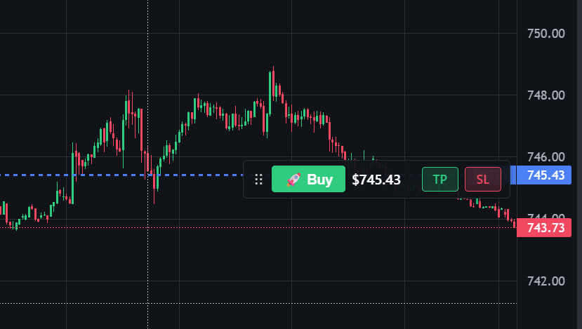
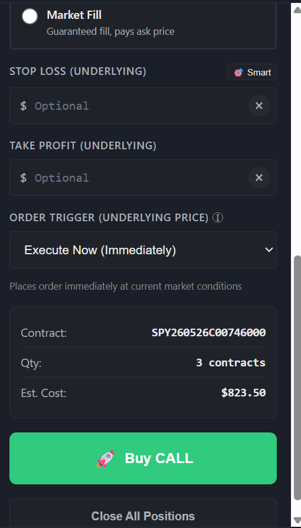

# OptionsCanvas

[](./LICENSE)


## Stop getting your stops hunted.

You see the setup forming on the SPY chart. You know exactly where you want to enter, exactly where you're wrong, exactly where you'll take profit — **all in SPY dollars, the chart you actually understand.**

Then you tab over to your broker. Pick an expiration. Scroll the strike ladder. Compute how many contracts $1,000 buys. Set the stop in *option premium* dollars (not the SPY level you actually understand). Submit. Watch a market-maker tap your stop on a wick fifteen seconds after the open.

**OptionsCanvas fixes both halves of that.**

- **Your stops live locally.** Not on the broker order book. Not visible to the HFTs that profit from hunting them. We only send a market order at the moment the underlying actually breaches your level.
- **You never touch the options chain.** You drag your entry, SL, and TP directly on the underlying's chart — we pick the strike, the DTE, the contract count, and project the option premium and P&L in real time as you drag.

Two-keystroke execution. Runs 100% on your machine. **The first open-source options platform that does this.**



---

## Built for the active options trader who…

- Trades **short-dated options** — whether that's **0 DTE on SPY** or **a month out on AAPL** — directly off the underlying chart
- Wants to think in **underlying price** (the chart you actually read), not in option premium
- Has been **stop-hunted** one too many times and never wants a resting stop in the broker's book again
- Refuses to **click 7 times** to get a trade on
- Needs **hotkeys, flatten-all, and one-gesture brackets** — not modal dialogs

Works on any optionable US equity or ETF your broker supports — index ETFs, single names, leveraged ETFs, whatever. Configure your watchlist and the platform pulls expirations + strike increments straight from the broker.

If that's you, keep reading.

---

## What makes it different

### 🎯 Your chart is your order ticket
Drag the **Buy**, **SL**, and **TP** pills directly on the underlying chart. No ticket window. No popups. The price line *is* the control.
- Drag **Buy** away from live price → flips into a limit-trigger with an anchored `ENTRY` line
- Drag **TP** or **SL** up or down → level updates live, projected premium and P&L update with it

<table align="center" border="0">
  <tr>
    <td width="50%"></td>
    <td width="50%"></td>
  </tr>
  <tr>
    <td align="center"><i>Drag SL/TP on the underlying — premium + P&amp;L recompute as you drag.</i></td>
    <td align="center"><i>Drag Buy off live price — becomes a limit-trigger with an anchored ENTRY line.</i></td>
  </tr>
</table>


### 🛡️ Stops your broker can't see — and can't hunt
Stops and targets do **not** sit in your broker's order book. They live in your local machine and only become a real market order at the instant the underlying actually breaches your level.
- No resting stop for HFTs to sweep
- No "stop tag + reverse" 15 seconds after the open
- The broker sees a market order *after* the breach, never before
- You stop providing free liquidity to the venue

```
   You set SL @ 449.50
            │
            ▼
  ┌───────────────────────┐
  │    trading_engine     │   ← stop lives here, in memory + SQLite
  │   holds SL locally    │     (broker never sees it)
  └───────────┬───────────┘
              │
              │  polls underlying quote
              ▼
      underlying ≤ 449.50 ?
              │
              │  yes
              ▼
  ┌───────────────────────┐
  │   market SELL fires   │   → broker (first time the
  │       to broker       │     order book sees anything)
  └───────────────────────┘
```

### 🧠 Think in the underlying. Trade in options.
You set levels on the **underlying chart** (e.g. your ticker at 449.50). OptionsCanvas does the contract math.
- **Auto-picks the contract** — DTE from your configured presets (0 DTE, weeklies, monthlies — whatever you list), ATM strike from the live chain, both pulled fresh from the broker
- **Black-Scholes overlay** projects the option premium and your P&L *while you drag*, so you see "if the underlying hits 451, this call is worth $2.40 and you make $640"
- Strike increments and expirations come from the **broker as source of truth** — no manual contract config, no stale chains

<p align="center"></p>

*One screenshot, the whole pitch: SL and TP labeled in **underlying dollars** (not option premium). One-tap **Smart** button auto-sets stops from ATR. The contract `SPY260526C00746000`, the **3-contract** size, and the **$823.50** cost — all computed for you. Hit the big green button, you're in. Hit "Close All Positions", you're flat.*

### ⚡ Speed of execution
Built so a trade is **two keystrokes**, not seven clicks.
- `B` → Buy CALL at market (ATM, auto-sized)
- `S` → Buy PUT at market
- `F` → Flatten **all** positions, instantly
- `Shift+B` → Bracket draw mode: click entry, drag to TP, release — done
- `C` → Toggle CALL/PUT  •  `↑`/`↓` → strike up/down
- `1`–`5` → preset position sizes ($500 / $1k / $2k / $5k / $10k)
- `Alt + 1..6` → 1m / 5m / 15m / 30m / 1h / 1d timeframe
- `Alt + ←/→` → previous/next symbol  •  `?` → cheatsheet

### 🎨 One-gesture bracket orders
Hit `Shift+B`, click entry, drag to where you want profit. Direction of drag picks CALL vs PUT. Default **2:1 R:R** is auto-applied. Release to send. That's the whole interaction.

### 🤖 Smart defaults that aren't dumb
- **ATR-based SL** (1.5× ATR-14) reconciled against **swing high/low** lookback — picks the more conservative
- **2:1 R:R TP** by default, override per trade
- **Smart sizing presets** so you stop fat-fingering 100 contracts at 3:59pm

### 📊 The chart you'd actually use
TradingView Lightweight Charts under the hood. Multi-symbol, multi-timeframe.
- **Indicators**: VWAP, SMA, EMA, RSI, Volume — toggle per chart
- **Drawing tools**: trend lines, rectangles, horizontals
- Dark theme, 60fps, no garbage
- **Right-click context menu** with everything one click away

*(The hero image at the top of this page is exactly this — chart, indicators, draggable Buy/SL/TP pills, side panel, broker pill, Day P&L — all rendered live.)*

### 🔒 Local. Private. Yours.
- Runs 100% on your machine — Flask on `127.0.0.1:5001`
- Your keys live in `config/config.json`, your state in `assisted_trading/state/trading.db`
- **Zero telemetry.** The only outbound traffic is to your broker.
- No SaaS, no login, no "free tier", no one watching your levels

### 🧱 Risk controls that actually fire
- **Per-symbol position caps** and **max simultaneous positions**
- Configurable **trading hours** (auto-blocks orders outside the window)
- **Auto-sell on SL breach** (toggle off if you prefer manual)
- **Daily trade limits** and accept-partial-fill behavior, all in JSON config

### 📓 Every trade journaled — automatically
Stop maintaining your trading journal in a spreadsheet. OptionsCanvas writes every fill, every close, every realized P&L to your local SQLite DB as it happens.
- **Per-trade row** — option symbol, contracts closed, exit price, exit time, realized P&L
- **Daily aggregate** — total trades, win/loss count, gross profit/loss, net P&L, largest win/loss
- **Plain SQLite** at `assisted_trading/state/trading.db` — query with `pandas.read_sql`, DuckDB, Datasette, Jupyter, whatever you already use for analysis
- **JSON snapshots** under `assisted_trading/journal/<date>/trades.json` for human-readable review
- **REST endpoint** `GET /api/journal?start_date=...&end_date=...` for building your own dashboards
- It's your data, on your disk — nothing leaves the machine

### 🔌 Broker-agnostic by design
Currently two brokers ship out of the box:
- **Alpaca** — production-tested. The reference implementation used during development.
- **Tradier** — *implementation complete but not yet validated end-to-end against a live Tradier sandbox account. Working through that now — see [Broker support status](#broker-support-status) below.*

The broker layer is an abstract interface (`broker_interface.py`) with a declarative registry (`broker_registry.py`) — adding IBKR, Tastytrade etc. is one new file in `backend/` and one entry in the registry. The wizard UI renders dynamically from the registry, so a new broker shows up without any frontend edits.

---

## Setup

**Prereqs:** Python 3.10+ (or Docker) and a free paper-trading account from a supported broker — [Alpaca](https://alpaca.markets) (recommended) or [Tradier](https://tradier.com) (experimental — see [Broker support status](#broker-support-status)). Both take ~2 minutes to create and don't risk real money.

### The whole thing, in 3 steps:

1. **Download** — [grab the latest ZIP](https://github.com/calesthio/OptionsCanvas/archive/refs/heads/main.zip) (or `git clone`) and unzip it.
2. **Launch** — pick whichever is easiest:
   - **Windows**: double-click `OptionsCanvas.bat`
   - **macOS / Linux**: `./optionscanvas.sh` *(first time: `chmod +x optionscanvas.sh`)*
   - **Docker (any OS)**: `docker compose up -d` — see [Docker](#docker) below

   On the first native run it creates a Python venv and installs deps (~2 min). Subsequent launches are instant.
3. **Follow the wizard** — your browser opens to the setup wizard:
   - Pick a broker (Alpaca recommended; Tradier supported but [not yet end-to-end tested](#broker-support-status)) → paste keys → "Test connection"
   - Pick a trading universe: **Recommended 30** (default), **Full 110**, or your own custom watchlist
   - Click **"Start trading"**

That's it. The trading UI takes over and you're live on paper money.

The wizard also runs idempotently — you can revisit `http://localhost:5001/setup` later to re-onboard symbols or rotate keys.

<a id="docker"></a>
<details>
<summary><b>Docker</b></summary>

Single command, any OS:

```bash
docker compose up -d        # build + start
# open http://localhost:5001/setup
docker compose logs -f      # tail logs
docker compose down         # stop
```

`config/` and `assisted_trading/state/` are bind-mounted, so your broker keys and trading DB live in the repo dir and survive container rebuilds.

</details>

<details>
<summary><b>Power-user / manual setup</b></summary>

If you'd rather skip the launcher and do it by hand:

```bash
git clone https://github.com/calesthio/OptionsCanvas.git
cd OptionsCanvas
python -m venv .venv && source .venv/bin/activate   # Windows: .venv\Scripts\activate
pip install -r requirements.txt
python assisted_trading/run_platform.py             # opens browser to /setup wizard
```

Or skip the wizard entirely (Alpaca-only path — Tradier users should use the wizard):

```bash
cp config/config.example.json config/config.json    # then paste your Alpaca keys
python scripts/onboard_symbol.py                    # default: 30 Tier-1 names
python scripts/onboard_symbol.py --all              # full 110-name universe
python scripts/onboard_symbol.py AAPL MSFT NVDA     # custom tickers
python assisted_trading/run_platform.py
```

The Tier-1 default covers SPY, QQQ, NVDA, TSLA, IWM, the Mag-7, top semis (AMD, MU, INTC, AVGO, SOXL/SOXS), high-flow retail names (PLTR, HOOD, MSTR, COIN, F, AAL), sector ETFs (XLE, XLF), and leveraged QQQ (TQQQ/SQQQ). `--all` adds 80 more across financials, pharma, energy, consumer, China, vol, and bonds.

**Optional — browser tests (Playwright):**
```bash
npm install && npx playwright install chromium
```

</details>

---

## Hotkeys cheatsheet

| Key | Action |
|---|---|
| `B` / `S` | Buy CALL / Buy PUT at market |
| `F` | **Flatten all positions** |
| `Shift+B` | Bracket-draw mode (click entry, drag to TP) |
| `C` | Toggle CALL ↔ PUT |
| `↑` / `↓` | Strike up / down |
| `1`–`5` | Position size: $500 / $1k / $2k / $5k / $10k |
| `Alt + 1..6` | 1m / 5m / 15m / 30m / 1h / 1d |
| `Alt + ← / →` | Previous / next symbol |
| `D` / `T` | Draw horizontal / trend line |
| `Esc` | Cancel drawing / bracket mode |
| `?` | Show full shortcuts modal |

---

## Broker support status

| Broker | Status | Notes |
|---|---|---|
| **Alpaca** | ✅ Production-tested | The reference broker used during development. All flows (validate, chart data, option chains, place/cancel orders, positions, server-side stops) exercised continuously against a paper account. |
| **Tradier** | 🧪 Implementation complete, end-to-end testing in progress | All `BrokerInterface` methods implemented against Tradier's documented REST API. Verified against the sandbox endpoint at a unit level (auth, error handling, response parsing) but not yet validated through a full sandbox trading session. Use at your own risk until this row turns green; please file issues if you see anything off. |

Adding a new broker requires one file in `assisted_trading/backend/<name>_broker.py` (implementing `BrokerInterface`) and one entry in `broker_registry.py` — no frontend or trading-engine edits. Contributions welcome.

---

## Configuration

- **`config/config.json`** — broker credentials + paper/live mode + global defaults (gitignored, never commit). Written by the setup wizard; you almost never need to edit it by hand.
- **`assisted_trading/config/assisted_trading_config.json`** — enabled symbols, DTE presets, position-size presets, max positions, trading hours, auto-sell, entry-order type
- **Broker accounts** — free paper accounts at [Alpaca](https://alpaca.markets) or [Tradier](https://tradier.com). Paper and live use separate API keys on both brokers — generate the right pair from each broker's API settings page.

---

## Architecture

- **Frontend (vanilla JS)** — `ChartManager` owns Lightweight Charts. `OrderPanelOnChart` renders draggable pills. `ChartTradingController` bridges chart ↔ side panel. `BlackScholesCalculator` projects premium + P&L. `BracketOrderDrawer` handles one-gesture brackets. `KeyboardShortcutManager` for hotkeys. `SmartDefaults` for ATR-based SL/TP. The setup wizard (`setup.html`) renders dynamically from `/api/setup/brokers`.
- **Backend (Flask + SocketIO)** — `chart_api_server.py` exposes REST + WS. `trading_engine.py` runs the loop: entries, fill monitoring, SL/TP breach checks, with a TTL cache + graceful fallback on transient broker errors. `order_manager.py` + `position_manager_v2.py` persist to SQLite. `state_machine.py` enforces invariants. `setup_routes.py` powers the first-run wizard.
- **Broker layer** — `broker_interface.py` (abstract base) + `broker_registry.py` (declarative metadata, drives wizard UI) + `broker_factory.py` (builds instances) + `alpaca_broker.py` and `tradier_broker.py` (concrete impls). Add a broker: drop one file in `backend/`, add one entry in the registry.
- **State** — SQLite at `assisted_trading/state/trading.db`, auto-migrates on boot.

More: [`docs/ARCHITECTURE.md`](docs/ARCHITECTURE.md).

---

## Testing

```bash
pip install -r requirements-test.txt                 # one-time
pytest -q                                            # ~190 unit + property + integration tests
python assisted_trading/run_platform.py &            # then, in another shell:
npx playwright test tests/browser/chart_trading.spec.js
```

Screenshots in this README are captured by `tests/browser/_screenshots.spec.js` against the live app.

---

## Contributing

PRs welcome — see [`CONTRIBUTING.md`](CONTRIBUTING.md). Keep changes focused, run the suites, respect the broker abstraction and state machine.

---

## If this is useful to you

A star on the repo genuinely helps — it's how other options traders find it. Solo dev project with no marketing budget, so word-of-mouth is all there is. If you end up using OptionsCanvas day-to-day, opening an issue with what's working / not working is even more valuable than a star.

---

## License

AGPL-3.0-or-later. © 2026 calesthio. See [`LICENSE`](LICENSE).
**Plain English**: run a modified version as a network service → you must share the modified source. Fork it privately for your own trading → you're fine.

Third-party components and their licenses (TradingView Lightweight Charts™, Alpaca-py, Flask, Socket.IO, etc.) are catalogued in [`THIRD_PARTY_NOTICES.md`](THIRD_PARTY_NOTICES.md).

---

## Disclaimer

- **Paper trading is the default** — the setup wizard's mode selector defaults to "Paper" on every supported broker. Live trading is supported (switch the toggle to "Live" in the wizard, or edit `config/config.json`'s `broker.mode`), but the launcher, server, and trading UI all surface loud warnings (terminal banner, server log, red broker pill, app-wide red border, `[LIVE]` browser-tab prefix) so you can't end up there by accident.
- **Options trading involves substantial risk of loss.** You can lose 100% of premium; in some configurations more.
- **Not financial advice.** A tool, not a recommendation. Indicators, projected P&L, defaults — none of it is advice.
- **No warranty.** Authors and contributors are not liable for losses, missed fills, slippage, broker outages, software bugs, or stops that fail to trigger — paper or live.
- **If you don't understand exactly what an order will do before you place it — don't place it.**
